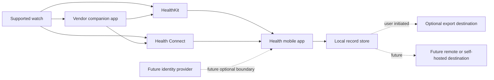
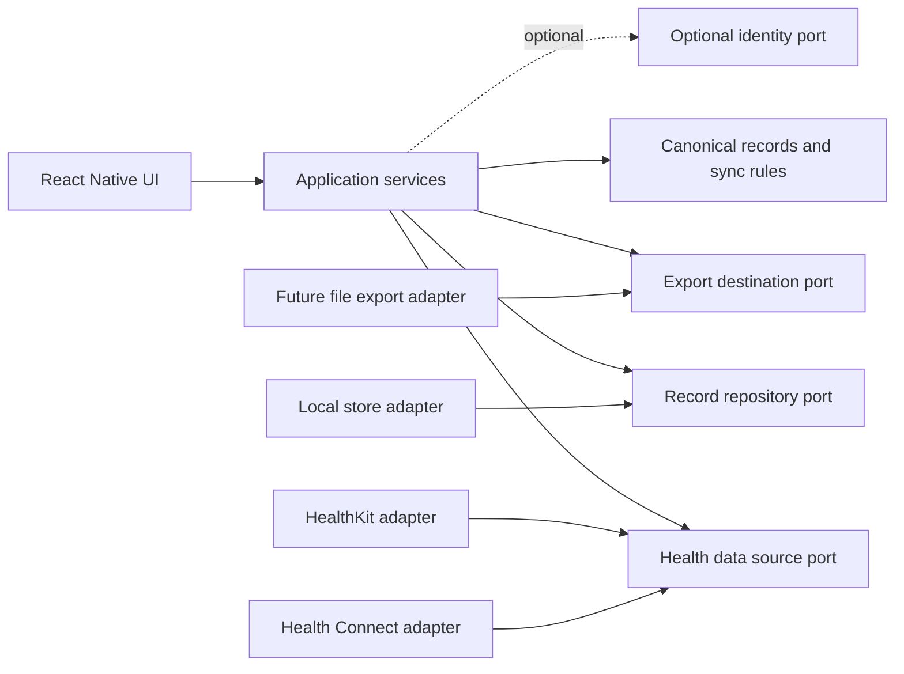

# Architecture

## Decision summary

Health starts as a local-first modular mobile application. React Native owns the
user experience and application workflow. Native Swift and Kotlin adapters
translate HealthKit and Health Connect data into a vendor-neutral domain model.

This is a single deployable application, not a distributed system. Ports isolate
the parts expected to vary without creating services or abstractions for
unconfirmed requirements.

## Quality priorities

1. Privacy and user control
2. Modifiability and forkability
3. Data provenance and correctness
4. Offline reliability
5. Testability
6. Delivery speed

Peak scale and server availability do not drive the MVP because no server is in
the data path.

## System context

The diagram shows possible data paths, not a promise that every watch or
companion application writes every metric to a platform store.

## Internal boundaries

Dependencies point toward stable contracts. The core does not import native
platform, storage, authentication, or UI packages.

## Responsibilities

| Boundary | Responsibility | Must not own |
| --- | --- | --- |
| UI | Consent context, permission state, sync status, local views | Platform payload mapping |
| Application services | Coordinate permission, import, normalization, and persistence | Vendor-specific fields |
| Core | Canonical records, validation, checkpoints, deduplication rules | Native API calls or credentials |
| Source adapter | Read one platform or provider and map its records | Persistence policy |
| Record repository | Atomically store canonical records and checkpoints | Source API behavior |
| Destination adapter | Export or synchronize canonical records | Core transformations |
| Identity adapter | Establish an optional external identity | Ownership of health records |

## Technology boundary

React Native communicates with platform APIs through typed native-module
contracts. React Native Codegen supports typed specifications for native
modules, while Expo development builds and Prebuild allow Swift, Kotlin, and
native configuration unavailable in Expo Go:

- [React Native native modules](https://reactnative.dev/docs/turbo-native-modules-introduction)
- [Expo development builds](https://docs.expo.dev/develop/development-builds/introduction/)
- [Expo custom native code](https://docs.expo.dev/workflow/customizing/)

The Android preview uses an in-repository Expo module backed by the stable
Jetpack Health Connect client. Keeping the native bridge local makes the four
read operations and their manifest permissions reviewable without exposing
Jetpack types to the core. The iOS integration remains undecided and requires a
separate maintenance, API coverage, privacy, licensing, and compatibility
review.

## Identity boundary

Authentication is absent from the MVP. The local repository operates without a
remote subject identifier.

A future remote destination can request an identity through a separate port.
Adapters may later implement Google, Apple, OpenID Connect, passkeys, or another
mechanism supported by that destination. Credentials and provider tokens remain
outside canonical health records and synchronization checkpoints.

This boundary avoids turning one identity provider into a prerequisite for
local use or for forks that choose a different deployment model.

## Fitness checks

Architecture reviews and future automated tests should enforce these rules:

- Core modules contain no `HealthKit`, `HealthConnect`, Apple, Google, or vendor
  payload types.
- Core tests run without iOS, Android, network, or authentication runtimes.
- Two in-memory source adapters can exercise the same synchronization service.
- A local repository and an in-memory repository satisfy the same contract.
- Adding a destination does not change source adapters.
- Adding identity does not change canonical record identifiers.
- Platform permission denial is represented as an expected state, not a crash.

## Unavoidable dependencies

Health cannot bypass operating-system permissions, store policies, provider
availability, or closed device protocols. Vendor neutrality means containing
and documenting those dependencies, not pretending they do not exist.
